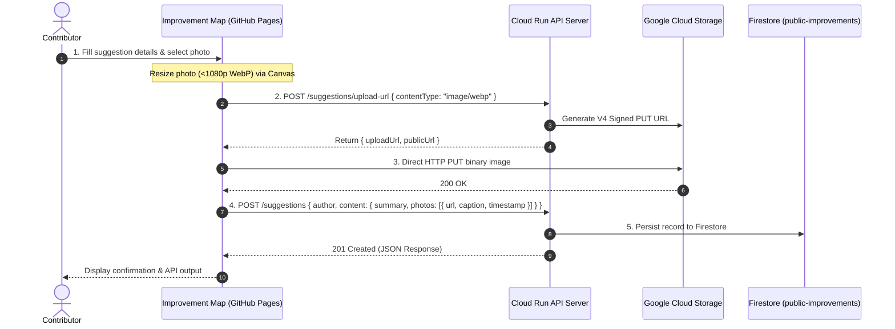

# Dallas Urbanists Improvement Map

A lightweight, zero-dependency client application for submitting civic improvement suggestions and uploading on-site photos directly to the Dallas Urbanists Cloud API.

Hosted on **GitHub Pages**: [https://dallasurbanists.github.io/improvement-map/](https://dallasurbanists.github.io/improvement-map/)

---

## 🌟 Features

- **Civic Improvement Suggestions**: Submit ideas, infrastructure issues, and public space improvement proposals with author details, summaries, markdown descriptions, and geographic coordinates.
- **Client-Side Photo Optimization**:
  - Automatically resizes selected images via HTML5 Canvas to a maximum resolution of $1920 \times 1080$.
  - Converts images to optimized **WebP** format to keep upload payload sizes minimal and loading speeds fast.
- **Secure Direct-to-GCS Upload**:
  - Requests short-lived **V4 Signed URLs** from the API server.
  - Uploads photo binary payloads directly from the browser to Google Cloud Storage (GCS), bypassing API server memory bottlenecks.
- **Dynamic API Environment Detection**:
  - Automatically connects to `http://localhost:8080` when tested locally (`localhost` / `127.0.0.1`).
  - Seamlessly switches to the live Google Cloud Run API server in production.
- **Zero Build Step**: Built with vanilla HTML5, CSS3, and modern JavaScript—runs natively in any modern web browser.

---

## 🏗️ Architecture & Upload Flow



---

## 🛠️ Tech Stack

- **Frontend**: Vanilla JavaScript (ES6+), HTML5, CSS3
- **Image Processing**: HTML5 Canvas API (`toBlob` + WebP compression)
- **Hosting**: GitHub Pages
- **Backend Service**: [Dallas Urbanists Cloud API Server](https://github.com/dallasurbanists/urbanists-cloud-api-server) (Google Cloud Run + Express.js + Firestore)
- **Object Storage**: Google Cloud Storage (`gs://urbanists-suggestion-photos`)

---

## 🚀 Local Development

No build tools, bundlers, or package installations are required.

### 1. Clone the repository
```bash
git clone https://github.com/dallasurbanists/improvement-map.git
cd improvement-map
```

### 2. Start a local web server
You can use any static file server:

```bash
# Using Python
python -m http.server 3000

# Using Node.js npx serve
npx serve .

# Or using VS Code Live Server extension
```

### 3. Open in Browser
Navigate to `http://localhost:3000` in your web browser.

> 💡 **Note on Local API Testing**:
> If you are running the backend locally on `http://localhost:8080`, ensure the server is started with `npm run dev` in the `urbanists-cloud-api-server` directory.

---

## 📡 API Endpoints Used

| Method | Endpoint | Description |
|---|---|---|
| `POST` | `/api/public-improvements/suggestions/upload-url` | Obtains a pre-authorized V4 Signed PUT URL for direct photo upload to GCS. |
| `POST` | `/api/public-improvements/suggestions` | Creates a new suggestion document with metadata, location, and photos array. |

---

## 📄 License

Open-source under the Dallas Urbanists community initiative.
